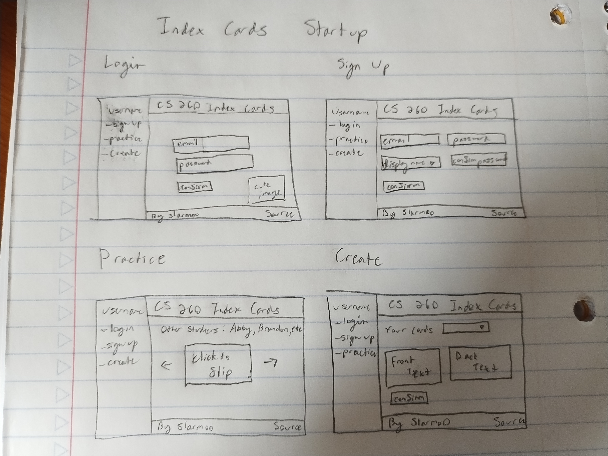

# cs260indexcards
Practice for making a CS 260 startup

## Elevator Pitch:
Do you need help studying for your CS 260 midterm? Your final? Use these index cards to study, and add your own! Practice with friends!

## Key Features:
- Secure sign up and login
- study a list of terms for CS260
- Add new terms to study
- See who else is studying, and how many cards they've done

## Technologies:
- HTML
    - Page structure. Four pages: login, sign up, practice, and create
- CSS
    - Page design. Make the pages look nice and understandable. Support multiple page sizes
- React
    - Reactivity. Automatically update display on user input
    - Router. Move between different pages with ease and protect pages that require login credentials
- Javascript
    - Create actual functionality, such as index card creation and practice
- Service
    - Secure login credentials for signing up, logging in, and logging out
    - Save and retrieve index cards
    - Call a [username generator](https://apiverve.com/marketplace/usernamegenerator) to offer username suggestions
- DB/Login
    - Save login credentials and new flashcards
- Websocket
    - Live updates for practicing with friends

## HTML Deliverable
- HTML pages - I have 4 HTML pages representing a login, a sign up, a practice, and a create page.
- Proper HTML element usage - I use header, footer, nav, body, label, p, div, and anchor tags.
- Links - Each of my pages links to the others.
- Text - Each index card contains (placeholer) text.
- 3rd party API placeholder - There is a placeholder on the sign up page for display names grabbed from an API.
- Images - A picture of index cards on the login page. 
- Login placeholder - The login and sign up pages are structural placeholders for future functionality.
- DB data placeholder - User data and index cards will be stored in and retrieved from the database.
- WebSocket placeholder - On the practice page you can see which other users are online and how many cards they've practiced.

## CSS Deliverable
- The Header, Main, and Footer are properly styled
- Navigation elements are properly styled
- My website is responsive to window resizing
- All application elements, text, and images are properly styled